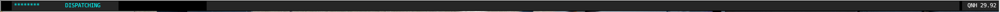

# XAutoCopilot

This is a script for [X-Plane](http://x-plane.com/), written in LUA for the Gizmo API.

--> http://gizmo64.com/

## currently included
[A320 NEO from JarDesign](http://airbus320neo.com/)
- automatically checklist, based on [FCOM 03.03](http://forums.x-plane.org/index.php?app=downloads&showfile=27377)
- All Animations included ( open door´s / cargo / stair ....)
- Cockpit preparation with original wait time of Aligned NAV (7 minutes)
- ~~Automaticaly Anti Ice on/ off~~
- MCDU Settings automaticaly set
- Automaticaly Flap setting dependent from MCDU setting
- Automaticaly QNH Setup
- ...

## feature list
-more Aircraft`s
...

## todo
- [ ] code cleanup
- [ ] ...

## Installation:

Copy ,after unzipping, the Folder "scripts" in your Neo root Folder.
Don´t forget, it is a Gizmo script, install also Gizmo in your plugin folder !

## InGame Screenshots

This is the InGame Menu from Gizmo + my own icons

- 
This Icon starts the Checklist, after click on "execute" is this windows vanished.
Until the next check...

- 
text in work...

- 
text in work...

- 
text in work...

- 
text in work...

- 
text in work...

- 
text in work...

